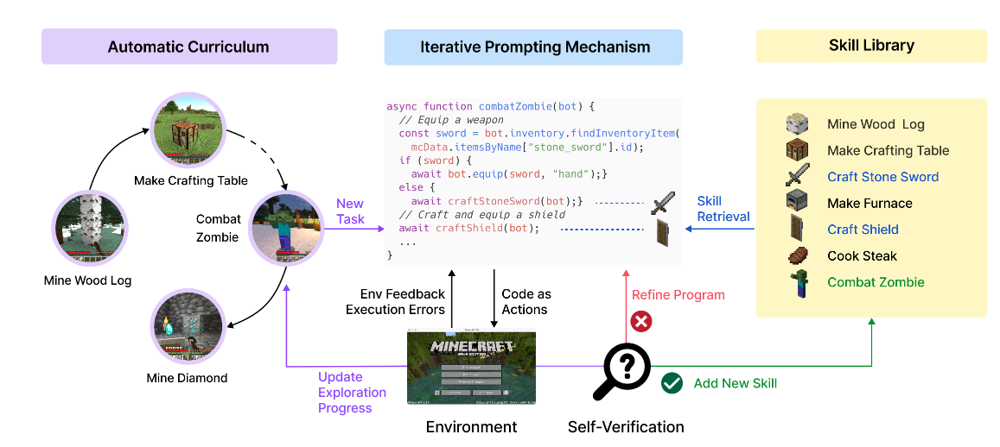
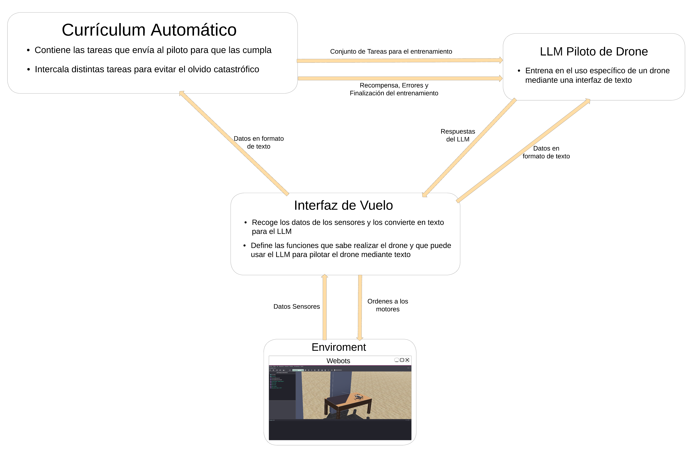

# Proyecto de TFG: Estudio de LLM's aplicados a control de drones autónomos

## Tabla de Contenidos
1. [Introducción](#introducción)
2. [Motivación](#motivación)
3. [Idea del Proyecto](#idea-del-proyecto)
4. [Fases del Proyecto](#fases-del-proyecto)
3. [Diagrama de Componentes](#diagrama-de-componentes)
4. [Funcionamiento del Sistema](#funcionamiento-del-sistema)
5. [Modelo de Machine Learning](#modelo-de-machine-learning)
6. [Referencias](#referencias)

## Introducción

Con esta idea para el TFG planteo un sistema para que un LLM controle un Drone mediante texto con el fin de que realice
tareas complejas, como encontrar tarjetas en un edificio simulado o seguir objetivos en movimiento.

## Motivación

Quería hacer un TFG sobre Inteligencia Artificial para llevar al límite todo lo que he aprendido en estos años sobre machine learning y programación.

La idea de este proyecto se basa en el paper 
"[Voyager: An Open-Ended Embodied Agent with Large Language Models](https://voyager.minedojo.org/)", en el que  se
estudia cómo un LLM aprende a jugar a Minecraft sin ayuda externa, más allá de la definición de objetivos. En el caso de 
Voyager se usan tres elementos:
1. Un Currículum Automático que gestiona los logros y los objetivos del agente.
2. Un Mecanismo de Promting Iterativo que interactúa con el LLM y le permite definir posibles nuevas habilidades y recibir información del entorno
3. Una biblioteca de Habilidades que permite reutilizar conocimiento anterior al agente en forma de habilidades programadas.

## Idea del Proyecto

La idea principal es entrenar un LLM a pilotar un Drone dentro de una simulación para realizar tareas complejas como 
seguir un objetivo en movimiento o encontrar objetos escondidos dentro de la simulación.

Para éste caso he pensado en una estructura un poco distinta a la propuesta para Voyager (ver [Motivación]()), se basa en tres componentes 
(contando el LLM):
1. Un Currículum Automático, que contiene las posibles tareas del drone, establece distintos circuitos (para evitar el olvido catastrófico), y evalúa el trabajo del agente.
2. Una Interfaz de Vuelo, que contiene una serie de acciones que puede realizar el LLM para controlar el drone, como despegar, aterrizar, rotar, etc.
3. Un LLM que será un modelo open source que pueda entrenar para este problema específico.

## Fases del Proyecto
Soy consciente que puede ser complicado llevar a cabo un proyecto así por mi cuenta, pero considero que la creación de 
la Interfaz de vuelo podría ser un reto suficiente.

Para el proyecto completo debo desarrollar en una primera instancia la Interfaz de vuelo, posteriormente el currículum Automático y por último entrenar el LLM.

Para el Currículum Automático y el LLM esperaré al feedback de mi tutor de TFG, pero ya he pensado como hacer la interfaz de vuelo.

Para esta interfaz de vuelo usaré una red neuronal que aprenda a realizar las acciones complejas asociadas a las funciones 
de la interfaz de vuelo. Además para las imágenes de la cámara usaré un modelo ya entrenado para detectar objetos y su 
distancia realtiva, con el fin de conseguir una interfaz de texto para el LLM. Posteriormente a ésto, el currículum será
programado con todas las pruebas y la forma en la que encadenará las acciones. En última instancia se buscará una forma 
de entrenar el modelo con vuelos hechos por una persona con una interfaz para el piloto.

## Diagrama de Componentes

Éste diagrama es un ejemplo de cómo puede entrenarse la interfaz de vuelo de manera descentralizada 
para entrenarlo mediante aprendizaje reforzado y utilizar algotimos como PPO o A3C, o incluso un algoritmo evolutivo
como NEAT.

## Funcionamiento del Sistema

Explica en detalle cómo funciona el sistema. Puedes estructurar esta sección en varios subsecciones, por ejemplo:

### Arquitectura del Sistema

Describe la arquitectura general del sistema, incluyendo los principales módulos y cómo se comunican entre sí.

### Flujo de Datos

Explica el flujo de datos a través del sistema, desde la entrada hasta la salida final.

### Tecnologías Utilizadas

Lista las tecnologías, lenguajes de programación, y herramientas que vas a utilizar en el desarrollo del proyecto.

## Modelo de Machine Learning

Describe cómo funciona el modelo de machine learning que planeas usar. Incluye detalles sobre:

### Dataset

Describe el dataset que vas a utilizar para entrenar el modelo. ¿De dónde proviene? ¿Cómo es su estructura?

### Preprocesamiento

Explica los pasos necesarios para preparar los datos antes de alimentar el modelo.

### Entrenamiento

Describe el proceso de entrenamiento del modelo. ¿Qué algoritmo utilizarás? ¿Cuáles son los parámetros importantes?

### Evaluación

Explica cómo vas a evaluar el rendimiento del modelo. ¿Qué métricas utilizarás?

## Referencias

- @article{wang2023voyager,
  
    title   = {Voyager: An Open-Ended Embodied Agent with Large Language Models},

    author  = {Guanzhi Wang and Yuqi Xie and Yunfan Jiang and Ajay Mandlekar and Chaowei Xiao and Yuke Zhu and Linxi Fan and Anima Anandkumar},

    year    = {2023},

    journal = {arXiv preprint arXiv: Arxiv-2305.16291}
}

## Contacto

Incluye tu información de contacto para que los posibles tutores puedan comunicarse contigo fácilmente.

---

Espero que esta estructura te sea útil para organizar la información de tu proyecto de TFG en el README.md de tu repositorio de GitHub. ¡Buena suerte con tu proyecto!
